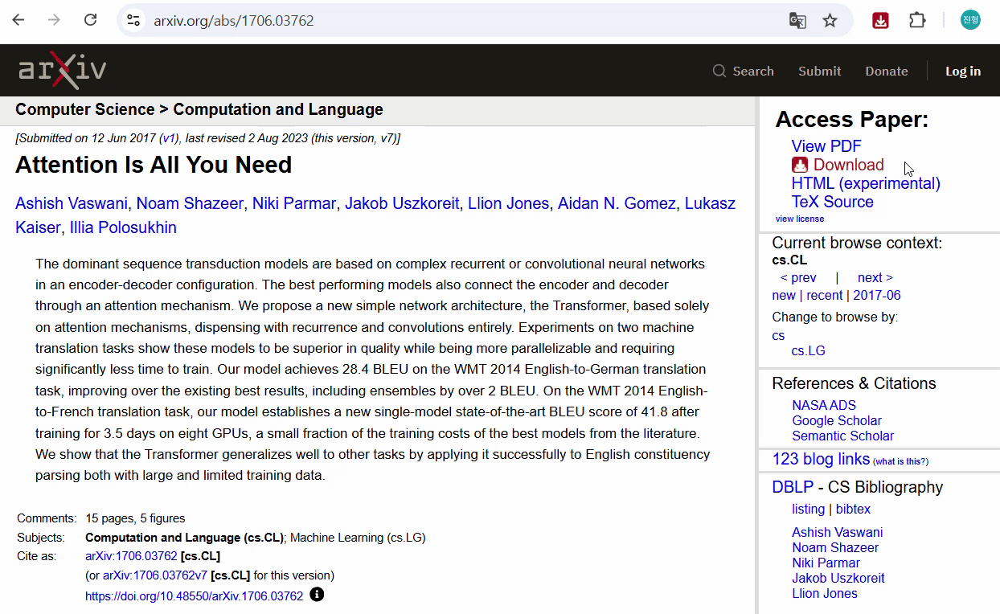

# arXiv Paper Downloader



Stop manually renaming files like `2603.03326v1.pdf` every time you download a paper from `arXiv`. This Chrome extension automatically renames arXiv paper downloads using a customizable filename format.

**Default format:** `FirstAuthorSurname-YYYY-Title.pdf`

**Example:**
```
2603.03326v1.pdf  →  Hoppe-2026-Controllable and explainable personality sliders for LLMs at inference time.pdf
```

## Features

- **Auto-rename on download** — Automatically renames arXiv paper downloads using paper metadata, wherever you download them from
- **Direct download button** — Adds a `Download` button with an icon below `View PDF` on arXiv abstract pages (`arxiv.org/abs/*`)
- **Download on PDF viewer** — Automatically renames PDFs downloaded from arXiv's PDF viewer (`arxiv.org/pdf/*`)
- **Popup download** — Lets you download the paper by clicking the extension icon on any arXiv abstract page
- **Customizable format** — Define your own filename pattern
- **API fallback** — Fetches metadata from the arXiv API even if you have not visited the abstract page first
- **Smart caching** — Caches paper metadata when you visit abstract pages for instant renaming


## Filename Customization
**Available Tokens**

| Token | Description | Example |
|-------|-------------|---------|
| `{author}` | First author surname | `Hoppe` |
| `{authorFull}` | First author full name | `Florian Hoppe` |
| `{allAuthors}` | All author surnames | `Hoppe, Khachaturov, Mullins, Meng` |
| `{year}` | Publication year | `2026` |
| `{month}` | Publication month | `02` |
| `{title}` | Paper title (cleaned) | `Controllable and explainable...` |
| `{arxivId}` | arXiv ID | `2603.03326` |
| `{category}` | Primary category | `cs.CL` |

## Settings

| Setting | Default | Options |
|---------|---------|---------|
| Colon replacement | `—` (em dash) | Any character(s) |
| Title spaces | Keep | Keep / Underscore / Hyphen / Dot |
| Title case | Original | Original / lowercase / Title Case |
| Max title length | Unlimited | Any number |
| Show "Save As" dialog | Off | On / Off |
| Auto-rename PDF downloads | On | On / Off |

## Installation

1. Download or clone this repository
2. Open `chrome://extensions/` in Chrome
3. Enable **Developer mode** (top right toggle)
4. Click **Load unpacked** and select the extension folder

## How It Works

1. **Abstract page** (`arxiv.org/abs/*`) — The content script extracts paper metadata from `<meta>` tags and caches it locally
2. **On-page download** — The extension adds an icon-labeled `Download` button below `View PDF` and starts a renamed download using the saved settings
3. **PDF download** — When Chrome initiates a download from `arxiv.org/pdf/*`, the background service worker intercepts the filename determination and suggests the custom filename
4. **Fallback** — If no cached metadata is found (e.g., navigating directly to a PDF URL), the extension fetches metadata from the [arXiv API](https://info.arxiv.org/help/api/index.html)

## License

MIT
